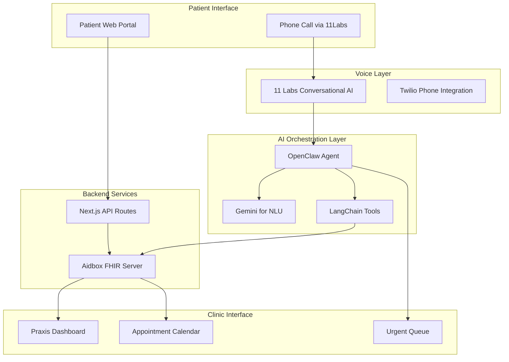

# Ignis - AI-Powered Patient Intake System

> "Give Doctors Their Time Back"

Ignis is an AI-powered patient intake system for German medical practices (Praxen) that automates phone-based patient registration and appointment booking using voice AI.

## The Problem

- ~100,000 Arztpraxen in Germany still rely on phone + paper intake
- Praxis staff spend 30-40% of their time on phone administration
- Patients wait an average of 12 minutes for phone scheduling
- Non-German speakers face significant barriers to healthcare access
- Doctors lose valuable patient time to administrative overhead

## Our Solution

An AI voice agent that:

- **Handles intake calls 24/7** with an empathetic, caring voice
- **3-tier intelligent triage**: Emergency (→human agent→112), Urgent (→same-day), Regular (→booking)
- **Recognizes returning patients** and pre-fills known data
- **Speaks German + 30+ languages** natively via 11 Labs
- **Never gives medical advice** - safety-first design
- **Integrates with existing systems** via FHIR standard

## Key Features

| Feature | Description |
|---------|-------------|
| Voice Intake | AI collects patient info via natural conversation |
| 3-Tier Triage | Emergency/Urgent/Regular classification |
| Patient Lookup | Returning patients identified by phone/DOB |
| Verification Portal | Patients verify AI-collected data via secure link |
| AI Flags | Doctor sees flags for items needing verification |
| Praxis Dashboard | Real-time view of patients, appointments, urgent queue |

## Architecture



## Tech Stack

| Layer | Technology |
|-------|------------|
| Frontend | Next.js 14 + Tailwind + shadcn/ui |
| Backend | Next.js API Routes |
| FHIR Server | Aidbox Cloud Sandbox |
| Voice AI | 11 Labs Conversational AI |
| Phone | Twilio (via 11 Labs) |
| Agent | OpenClaw |
| NLU | Gemini |
| Orchestration | LangChain |

## Quick Start

### 1. Get Aidbox License (Free for Development)

1. Go to [https://aidbox.app](https://aidbox.app) and create an account
2. After login, click on your **project name** in the sidebar
3. Click **Assets** from the menu
4. Click **New Aidbox** (upper right)
5. Configure:
   - **License type**: Dev
   - **License name**: ignis-hackathon
   - **Goal**: Development
   - **Hosting**: Self-hosted
6. Click **Create**
7. Copy the `AIDBOX_LICENSE_ID` and `AIDBOX_LICENSE_KEY` from the created license

### 2. Configure Environment

```bash
cp .env.example .env
# Edit .env and add your Aidbox keys:
# AIDBOX_LICENSE_ID=<your-license-id>
# AIDBOX_LICENSE_KEY=<your-license-key>
```

### 3. Start Services

```bash
./infra/setup-aidbox.sh
```

This will:
- Start PostgreSQL and Aidbox containers
- Wait for health checks
- Load demo FHIR data (patients, practitioners, appointments)

### 4. Verify

- Aidbox UI: http://localhost:8080 (admin/ignis2026)
- n8n Workflows: http://localhost:5678 (admin/ignis2026)

## Infrastructure

See `infra/` directory for server provisioning:

```bash
# Provision Hetzner server
./infra/provision.sh

# Setup after provisioning
./infra/setup-remote.sh <server-ip>

# Setup Aidbox with demo data
./infra/setup-aidbox.sh

# Add team member SSH keys
./infra/user-setup.sh <server-ip>

# Teardown when done
./infra/teardown.sh
```

## Server Access

```bash
ssh hackathon@167.235.236.238
```

## Services

| Service | Port | Credentials |
|---------|------|-------------|
| Aidbox (FHIR Server) | 8080 | admin / ignis2026 |
| n8n (Workflows) | 5678 | admin / ignis2026 |
| OpenClaw (AI Agent) | 3000 | - |

## Project Structure

```
ignis/
├── app/                  # Next.js app
│   ├── api/              # Backend APIs
│   ├── praxis/           # Clinic dashboard
│   └── patient/          # Patient-facing UI
├── components/           # React components
├── lib/                  # Core libraries
│   ├── elevenlabs/       # Voice AI
│   ├── fhir/             # FHIR client
│   ├── openclaw/         # Agent orchestration
│   └── ai/               # Triage/classification
├── infra/                # Infrastructure scripts
├── docs/                 # Documentation
└── scripts/              # Utilities
```

## Documentation

See [docs/PLAN.md](docs/PLAN.md) for the detailed implementation plan including:
- Flow diagrams (Architecture, Triage, Emergency Detection, Verification Portal)
- Team distribution and workstreams
- Pitch deck structure
- Demo script
- Technical specifications

## Team

Built at a hackathon by Team Ignis, leveraging:
- 11 Labs (Voice AI)
- Gemini (NLU)
- Aidbox (FHIR)
- OpenClaw (Agent)
- Cursor (IDE)

## License

MIT
