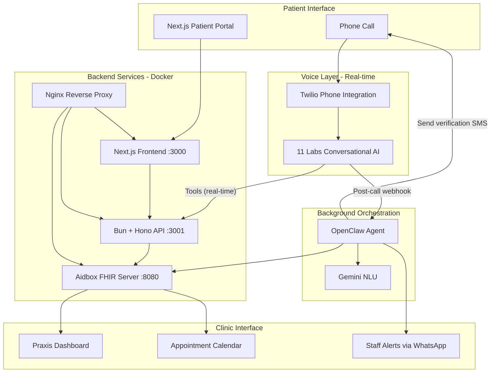

# Ignis - AI-Powered Patient Intake System

> "Give Doctors Their Time Back"

Ignis is an AI-powered patient intake system for German medical practices (Praxen) that automates phone-based patient registration and appointment booking using voice AI.

## The Problem

- ~100,000 Arztpraxen in Germany still rely on phone + paper intake
- Praxis staff spend 30-40% of their time on phone administration
- Patients wait an average of 12 minutes for phone scheduling
- Non-German speakers face significant barriers to healthcare access
- Doctors lose valuable patient time to administrative overhead

## Our Solution

An AI voice agent that:

- **Handles intake calls 24/7** with an empathetic, caring voice
- **3-tier intelligent triage**: Emergency (→human agent→112), Urgent (→same-day), Regular (→booking)
- **Recognizes returning patients** and pre-fills known data
- **Speaks German + 30+ languages** natively via 11 Labs
- **Never gives medical advice** - safety-first design
- **Integrates with existing systems** via FHIR standard

## Key Features

| Feature | Description |
|---------|-------------|
| Voice Intake | AI collects patient info via natural conversation |
| 3-Tier Triage | Emergency/Urgent/Regular classification |
| Patient Lookup | Returning patients identified by phone/DOB |
| Verification Portal | Patients verify AI-collected data via secure link |
| AI Flags | Doctor sees flags for items needing verification |
| Praxis Dashboard | Real-time view of patients, appointments, urgent queue |

## Architecture

**Hybrid approach:** ElevenLabs handles real-time voice conversation via Twilio, OpenClaw manages background tasks and smart notifications. Next.js frontend runs as separate service from Bun API backend.



### Component Roles

| Component | Role | When |
|-----------|------|------|
| **ElevenLabs** | Voice conversation, triage, patient lookup, booking | During call (real-time) |
| **Twilio** | Phone infrastructure, media streaming | During call |
| **Next.js Frontend** | Patient portal, praxis dashboard UI | Web access |
| **Bun + Hono API** | HTTP endpoints for ElevenLabs tools, frontend APIs | During call + web access |
| **Aidbox** | FHIR data storage (patients, appointments, questionnaires) | Always |
| **OpenClaw** | SMS notifications, staff alerts, call analysis, follow-ups | After call (background) |
| **Gemini** | Intent classification, confidence scoring | Called by OpenClaw |
| **Nginx** | Reverse proxy, SSL termination, routing | Always |

## Tech Stack

| Layer | Technology | Purpose | Status |
|-------|------------|---------|--------|
| Frontend | Next.js 15 (App Router) + TypeScript + Tailwind v4 + shadcn/ui | Praxis dashboard + Patient portal | ✅ 70% |
| Backend | Bun + Hono | Real-time APIs for ElevenLabs tools + frontend | ✅ 95% |
| FHIR Server | Aidbox (Docker) | Patient/appointment/questionnaire data storage | ✅ 100% |
| Voice AI | **ElevenLabs Conversational AI Agent "Lisa"** | **German/English phone conversation, 3-tier triage** | **✅ 95%** |
| Phone | **Twilio → ElevenLabs** | **Inbound calls route to voice agent** | **✅ 100%** |
| Background Agent | OpenClaw | Post-call tasks, notifications, follow-ups | ❌ Planned |
| NLU | Gemini | Intent classification, confidence scoring | ❌ Planned |
| Reverse Proxy | Nginx (Docker) | SSL termination, routing | ✅ 100% |
| Database | PostgreSQL 16 (Docker) | Aidbox FHIR storage | ✅ 100% |

## Project Status

**Overall Progress: ~65% Complete**

✅ **Completed** (Backend + Infrastructure + Core Frontend — ~65%)

**Backend (95% Complete):**
- ✅ Bun + Hono API with full routing
- ✅ FHIR client and Aidbox integration
- ✅ **Patients API**: lookup (phone/DOB/name), create, update - Aidbox-backed
- ✅ **Appointments API**: slots (with urgency filter), book, cancel - Aidbox-backed
- ✅ **Queue API**: urgent queue, emergency queue - Aidbox Task-backed
- ✅ **Callback API**: request callback - Aidbox Task-backed
- ✅ **Questionnaires API**: list, search, get by ID, patient-intake endpoint
- ✅ **Auth API**: JWT authentication with doctor/patient roles, token management
- ✅ **Chat API**: real-time chat sessions with AI
- ✅ **Voice API**: Twilio integration for phone calls, WebSocket media streaming
- ✅ **Doctor API**: patient management, medication requests
- ✅ OpenAPI spec (GET /api/openapi.json) and CORS for ElevenLabs tools
- ✅ Comprehensive test suite (10 test files covering all major routes)

**Infrastructure (95% Complete):**
- ✅ Docker-based deployment (nginx, frontend, api, aidbox, aidbox-db)
- ✅ Multi-container orchestration with health checks
- ✅ Automated deployment scripts (setup-remote.sh, update-server.sh)
- ✅ Nginx reverse proxy with SSL support
- ✅ PostgreSQL 16 for Aidbox FHIR storage

**Frontend (70% Complete):**
- ✅ Next.js 15 App Router + TypeScript
- ✅ Tailwind CSS v4 + shadcn/ui component library
- ✅ Dashboard pages: Fragebogen, Termine, Wartezimmer, Patient details
- ✅ Chat interface with AI integration
- ✅ Calendar views (day/week)
- ✅ Questionnaire forms and progress tracking
- 🔄 Frontend-backend API wiring (partially complete)

**Voice Integration (95% Complete):**
- ✅ Twilio phone number connected to ElevenLabs agent
- ✅ ElevenLabs agent "Lisa" answering calls in German/English
- ✅ All 9 voice tools configured and connected to backend APIs
- ✅ System prompt v2.1 with emergency detection and 3-tier triage
- ✅ Comprehensive test scenarios documented
- 🔄 End-to-end flow testing in progress

🔴 **Not Started** (Critical Missing Features — ~35%)

**High Priority (P1):**
- ❌ **Patient Verification Portal** ([ig-i1u](bd://ig-i1u)) - Token-based secure access for patient data review
- ❌ **AI Flags System** ([ig-96p](bd://ig-96p)) - Confidence scoring and doctor review interface
- ✅ **Emergency Detection** ([ig-f1z](bd://ig-f1z)) - Implemented in system prompt, testing required
- 🔄 **ElevenLabs Voice Flow** ([ig-pfb](bd://ig-pfb)) - Tools configured, end-to-end testing needed
- ❌ **Demo Materials** ([ig-6m1](bd://ig-6m1)) - Pitch deck, script, German seed data

**Medium Priority (P2):**
- ❌ **OpenClaw Background Tasks** ([ig-mnm](bd://ig-mnm)) - Post-call automation (SMS, WhatsApp, call analysis)

📋 **Full Plan**: See [docs/PLAN.md](docs/PLAN.md)

## Quick Start

### 1. Install Dependencies

**Backend** (Bun + Hono)
```bash
# Bun is already installed in the project
~/.bun/bin/bun install
```

**Frontend** (Next.js)
```bash
cd frontend
~/.bun/bin/bun install
```

### 2. Start Development Servers

**Terminal 1 - Backend** (port 3000)
```bash
~/.bun/bin/bun run dev
```

**Terminal 2 - Frontend** (port 3001 or 3002 if 3001 is in use)
```bash
cd frontend
~/.bun/bin/bun run dev
```

**Local environment (required for chat/API):**
- **Backend:** Create `.env` in project root with `ELEVENLABS_API_KEY` and `ELEVENLABS_AGENT_ID` for the patient chat and voice features (see [ElevenLabs & Chat](#elevenlabs--chat) below).
- **Frontend:** Create `frontend/.env.local` with `API_URL=http://localhost:3000` so the Next.js app proxies `/api/*` to the backend. Without this, the chat page will get 500s when creating sessions.

Open http://localhost:3001 (or 3002) in your browser. Patient chat: http://localhost:3001/patient/chat

### Backend for ElevenLabs (Voice Team)

The Bun backend exposes the API contract and endpoints used by the ElevenLabs Conversational AI agent during real-time patient intake calls.

| Item | Value |
|------|--------|
| **Base URL (local)** | `http://localhost:3000` |
| **Base URL (deployed)** | `https://ignis.cognovis.de` (or set `API_BASE_URL` in env) |
| **OpenAPI spec** | `GET /api/openapi.json` — load this URL in ElevenLabs tools so the agent uses the correct request/response shapes. The spec’s `servers[0].url` is set from `API_BASE_URL` (default `http://localhost:3000/api`). |
| **CORS** | Enabled for `/api/*`; cross-origin requests from the voice app are allowed. |

### ElevenLabs & Chat

The **patient chat** (`/patient/chat`) and **voice agent** (Twilio + ElevenLabs) both need ElevenLabs credentials. No extra services are required—only environment variables.

| Context | What you need |
|--------|----------------|
| **Local dev (backend)** | `.env` in project root with `ELEVENLABS_API_KEY` and `ELEVENLABS_AGENT_ID`. |
| **Local dev (frontend)** | `frontend/.env.local` with `API_URL=http://localhost:3000` so `/api/*` is proxied to the backend. |
| **Deployed (Docker Compose)** | Set `ELEVENLABS_API_KEY` and `ELEVENLABS_AGENT_ID` in the same `.env` used by `docker compose`. The `api` service already receives them; no extra configuration on the server. |

**On the main site (deployed):** You do **not** need to install or run anything extra. Docker Compose passes these variables into the `api` container. Ensure the server’s `.env` (or the environment where you run `docker compose`) contains:

- `ELEVENLABS_API_KEY` — from [ElevenLabs Profile / API Keys](https://elevenlabs.io/app/settings/api-keys)
- `ELEVENLABS_AGENT_ID` — from the Conversational AI agent URL (e.g. `agent_xxxxx`)

After setting them, restart the API: `docker compose up -d api` (or redeploy with `./infra/update-server.sh`). The frontend container already uses `API_URL=http://api:3001` in Docker, so chat and voice work without further setup. See [infra/README.md](infra/README.md) for full deployment and env reference.

## API Route Overview

### Core Endpoints

| Method | Path | Description |
|--------|------|-------------|
| `GET` | `/health` | Health check (returns `{ status: 'ok', timestamp }`) |
| `GET` | `/api` | API info (version) |
| `GET` | `/api/openapi.json` | OpenAPI spec for ElevenLabs tools integration |

### Patients (`/api/patients`)

| Method | Path | Description | Status |
|--------|------|-------------|--------|
| `GET` | `/api/patients` | List all patients | ✅ Aidbox |
| `GET` | `/api/patients/lookup` | Find patient by `name`, `phone`, and/or `birthDate` | ✅ Aidbox |
| `POST` | `/api/patients` | Create new patient or update existing | ✅ Aidbox |

### Appointments (`/api/appointments`)

| Method | Path | Description | Status |
|--------|------|-------------|--------|
| `GET` | `/api/appointments/slots` | Get available slots (`date`, `urgency?`, `practitionerId?`, `limit?`) | ✅ Aidbox |
| `POST` | `/api/appointments` | Book appointment (`slotId`, `patientId`) | ✅ Aidbox |
| `POST` | `/api/appointments/cancel/:appointmentId` | Cancel an appointment | ✅ Aidbox |

### Queue (`/api/queue`)

| Method | Path | Description | Status |
|--------|------|-------------|--------|
| `POST` | `/api/queue/urgent` | Add patient to urgent queue | ✅ Aidbox Task |
| `POST` | `/api/queue/emergency` | Register emergency transfer | ✅ Aidbox Task |

### Callback (`/api/callback`)

| Method | Path | Description | Status |
|--------|------|-------------|--------|
| `POST` | `/api/callback` | Request callback (`phone`, `reason`, `category?`) | ✅ Aidbox Task |

### Questionnaires (`/api/questionnaires`)

| Method | Path | Description | Status |
|--------|------|-------------|--------|
| `GET` | `/api/questionnaires` | List/search questionnaires (`name?`, `status?`, `title?`) | ✅ Aidbox |
| `GET` | `/api/questionnaires/patient-intake` | Get the patient intake questionnaire | ✅ Aidbox |
| `GET` | `/api/questionnaires/:id` | Get questionnaire by ID | ✅ Aidbox |

### Auth (`/api/auth`)

| Method | Path | Description | Status |
|--------|------|-------------|--------|
| `POST` | `/api/auth/identify` | Level 1: Identify patient by phone/DOB | ✅ JWT |
| `POST` | `/api/auth/authenticate` | Level 2: Authenticate patient (voice match) | ✅ JWT |
| `POST` | `/api/auth/authorize` | Level 3: Authorize action (multi-factor) | ✅ JWT |
| `POST` | `/api/auth/verify-token` | Verify JWT token | ✅ JWT |
| `POST` | `/api/auth/refresh` | Refresh JWT token | ✅ JWT |

### Chat (`/api/chat`)

| Method | Path | Description | Status |
|--------|------|-------------|--------|
| `POST` | `/api/chat/session` | Create new chat session (body: `{}` or `{ patientId? }`) | ✅ ElevenLabs WebSocket |
| `POST` | `/api/chat/message` | Send message (body: `{ sessionId, message }`) | ✅ ElevenLabs |
| `GET` | `/api/chat/session/:id` | Get session history | ✅ Memory |
| `DELETE` | `/api/chat/session/:id` | End session | ✅ Memory |
| `GET` | `/api/chat/sessions` | List active sessions (non-production) | ✅ Memory |

### Doctor (`/api/doctor`)

| Method | Path | Description | Status |
|--------|------|-------------|--------|
| `GET` | `/api/doctor/patients` | List all patients | ✅ Aidbox |
| `GET` | `/api/doctor/patient/:id` | Get patient details | ✅ Aidbox |
| `GET` | `/api/doctor/patient/:id/appointments` | Get patient appointments | ✅ Aidbox |
| `POST` | `/api/doctor/patient/:id/prescribe` | Create medication request | ✅ Aidbox |

### Voice (`/api/voice`)

| Method | Path | Description | Status |
|--------|------|-------------|--------|
| `POST` | `/api/voice/sessions/start` | Start voice session | ✅ ElevenLabs |
| `POST` | `/api/voice/sessions/:id/end` | End voice session | ✅ ElevenLabs |
| `POST` | `/api/voice/sessions/:id/transfer` | Transfer to human agent | ✅ ElevenLabs |
| `GET` | `/api/voice/agents` | List available agents | ✅ ElevenLabs |

### Voice Integration (Twilio + ElevenLabs)

**Architecture:** Twilio phone number → ElevenLabs Conversational AI Agent → Backend APIs

**Agent Details:**
- **Name:** Lisa (Ignis Demo Praxis receptionist)
- **Agent ID:** `agent_2001kgaacwnff529zfp0nmh4ppjq`
- **Languages:** German (primary), English
- **System Prompt:** v2.1 with emergency detection, 3-tier triage
- **Voice Tools:** 9 tools configured and connected to backend

**Configured Tools:**
1. ✅ `patient_lookup` - Find patient by name/DOB
2. ✅ `patient_create_or_update` - Register new patients
3. ✅ `get_available_slots` - Find appointment times
4. ✅ `book_appointment` - Create appointments
5. ✅ `cancel_appointment` - Cancel appointments
6. ✅ `add_to_urgent_queue` - Same-day urgent queue
7. ✅ `register_emergency_transfer` - Emergency keyword detection
8. ✅ `request_callback` - Out-of-scope requests
9. ✅ `get_intake_questions` - Post-booking questionnaire

**Test Data:** 310+ patients, 240 practitioners, 560 slots available

**Documentation:**
- System Prompt: [docs/elevenlabs-system-prompt.md](docs/elevenlabs-system-prompt.md)
- Test Cases: [docs/elevenlabs-test-cases.md](docs/elevenlabs-test-cases.md)
- Tool Configs: [elevenlabs/tools/](elevenlabs/tools/)

### Twilio Integration (`/api/twilio`)

| Method | Path | Description |
|--------|------|-------------|
| `POST` | `/api/twilio/voice` | Inbound call webhook (returns TwiML) |
| `POST` | `/api/twilio/status` | Call status change webhook |
| `GET` | `/api/twilio/conversations` | Debug: list active conversations |
| `WS` | `/api/twilio/stream` | WebSocket for Twilio Media Streams |

**Status:** All API routes are now fully backed by Aidbox FHIR.

Use the same base URL for all requests (e.g. `http://localhost:3000/api/patients/lookup?birthDate=1985-03-15`).

### 3. Setup Aidbox (Optional - for FHIR backend)

**Get Aidbox License** (Free for Development)

1. Go to [https://aidbox.app](https://aidbox.app) and create an account
2. After login, click on your **project name** in the sidebar
3. Click **Assets** → **New Aidbox**
4. Configure: License type = **Dev**, Hosting = **Self-hosted**
5. Copy the `AIDBOX_LICENSE_ID` and `AIDBOX_LICENSE_KEY`

**Configure and Start**

```bash
cp .env.example .env
# Edit .env and add your Aidbox keys

./infra/setup-aidbox.sh
```

This will:
- Start PostgreSQL and Aidbox containers
- Wait for health checks
- Load demo FHIR data (patients, practitioners, appointments)

**Verify**

- Aidbox UI: http://localhost:8080 (admin/ignis2026)

## Deployment

### Main site (production)

On the server where you run Docker Compose, you **do not** need any extra services for ElevenLabs or the patient chat. Set in `.env` (or the environment used by `docker compose`):

- `ELEVENLABS_API_KEY`
- `ELEVENLABS_AGENT_ID`

The Compose file already passes these into the `api` service; the frontend uses `API_URL=http://api:3001` inside the stack. After changing env, restart: `docker compose up -d api` or run `./infra/update-server.sh`. See [infra/README.md](infra/README.md) for all env variables.

### Initial Setup (New Server)

```bash
# 1. Provision Hetzner server
./infra/provision.sh

# 2. Setup everything (clones repo, builds and starts all services)
./infra/setup-remote.sh <server-ip>
```

This will:
- Clone the repo to `/opt/ignis`
- Build Docker image for the app (Bun backend + React frontend)
- Start all Docker services (app, Aidbox, nginx)
- Configure nginx reverse proxy

### Updating Existing Server

After pushing code changes:

```bash
./infra/update-server.sh [server-ip]
```

This will:
- Pull latest code
- Rebuild Docker images
- Restart all services

### Manual Deployment

On the server:

```bash
cd /opt/ignis
git pull origin main
docker compose up -d --build
```

### Service Management

```bash
# Check all services
docker compose ps

# View logs
docker compose logs -f

# View specific service logs
docker compose logs app -f
docker compose logs aidbox -f
docker compose logs nginx -f

# Restart a service
docker compose restart app

# Rebuild and restart
docker compose up -d --build app
```

## Infrastructure

See `infra/` directory for server provisioning:

```bash
# Provision Hetzner server
./infra/provision.sh

# Setup after provisioning
./infra/setup-remote.sh <server-ip>

# Update after code changes
./infra/update-server.sh <server-ip>

# Add team member SSH keys
./infra/user-setup.sh <server-ip>

# Teardown when done
./infra/teardown.sh
```

## Server Access

```bash
ssh hackathon@167.235.236.238
```

## Services

| Service | Access | Credentials |
|---------|--------|-------------|
| **Ignis App** | http://server-ip/app/ | - |
| **Ignis API** | http://server-ip/api/ | - |
| **Aidbox UI** | http://server-ip/ | admin / ignis2026 |
| **FHIR API** | http://server-ip/fhir/ | admin / ignis2026 |

All services run in Docker and are proxied through nginx.

### Service Architecture

The deployment uses **separate containers** orchestrated via Docker Compose:

- **frontend**: Next.js 15 app (port 3000)
- **api**: Bun + Hono backend (port 3001)
- **aidbox**: FHIR server (port 8080)
- **aidbox-db**: PostgreSQL 16 database
- **nginx**: Reverse proxy (ports 80, 443)

```
Docker Network
├── nginx (ports 80, 443) → routes traffic
│   ├── /app/* → frontend:3000
│   ├── /api/* → api:3001
│   └── /fhir/* → aidbox:8080
├── frontend (Next.js) → port 3000
├── api (Bun + Hono) → port 3001 → aidbox:8080
├── aidbox (FHIR) → port 8080 → aidbox-db:5432
└── aidbox-db (PostgreSQL 16) → port 5432
```

### Managing Services

```bash
# Check all services
docker compose ps

# Check specific service
docker compose ps app

# View logs
docker compose logs -f         # All services
docker compose logs app -f     # Just the app

# Restart a service
docker compose restart app
docker compose restart nginx

# Rebuild and restart
docker compose up -d --build app
```

## Project Structure

```
ignis/
├── src/                     # Bun + Hono backend
│   ├── index.ts             # Entry point (serves API + frontend)
│   ├── routes/              # API route handlers
│   │   ├── patients.ts      # Patient lookup, create/update
│   │   ├── appointments.ts # Slots, book, cancel
│   │   ├── queue.ts         # Urgent / emergency queue stubs
│   │   └── callback.ts      # Request callback stub
│   └── lib/                 # Shared libraries
│       ├── schemas.ts       # Zod validation schemas
│       ├── config.ts        # Env/config (Aidbox URL, auth)
│       ├── fhir-client.ts   # Low-level FHIR HTTP client
│       ├── aidbox-patients.ts   # Patient CRUD via Aidbox
│       ├── aidbox-appointments.ts # Appointments/cancel via Aidbox
│       └── dummy-data.ts    # Legacy mock data (reference)
├── frontend/                # Vite + React frontend
│   ├── src/
│   │   ├── App.tsx          # Main app component
│   │   ├── components/      # React components (ui/, praxis/)
│   │   ├── pages/           # Page scaffolds
│   │   │   ├── praxis/      # Dashboard
│   │   │   └── patient/     # Book, Intake, Verify
│   │   └── lib/             # Frontend utilities (api, utils)
│   └── dist/                # Built frontend (served by backend)
├── infra/                   # Infrastructure & deployment
│   ├── setup-remote.sh      # Initial server setup
│   ├── update-server.sh     # Quick update script
│   ├── setup-aidbox.sh      # Aidbox setup script
│   ├── setup-services.sh    # Service configuration
│   ├── provision.sh         # Hetzner provisioning
│   ├── nginx/               # Nginx configs
│   └── ssl/                 # SSL certificates
├── docs/                    # Documentation
│   └── PLAN.md              # Detailed implementation plan
├── aidbox/                  # FHIR seed data
│   └── seed/
├── Dockerfile               # Docker image for app (backend + frontend)
└── docker-compose.yaml      # Multi-container orchestration
```

## Documentation

See [docs/PLAN.md](docs/PLAN.md) for the detailed implementation plan including:
- Flow diagrams (Architecture, Triage, Emergency Detection, Verification Portal)
- Team distribution and workstreams
- Pitch deck structure
- Demo script
- Technical specifications

## Team

Built at a hackathon by Team Ignis, leveraging:
- 11 Labs (Voice AI)
- Gemini (NLU)
- Aidbox (FHIR)
- OpenClaw (Agent)
- Cursor (IDE)

## License

MIT
