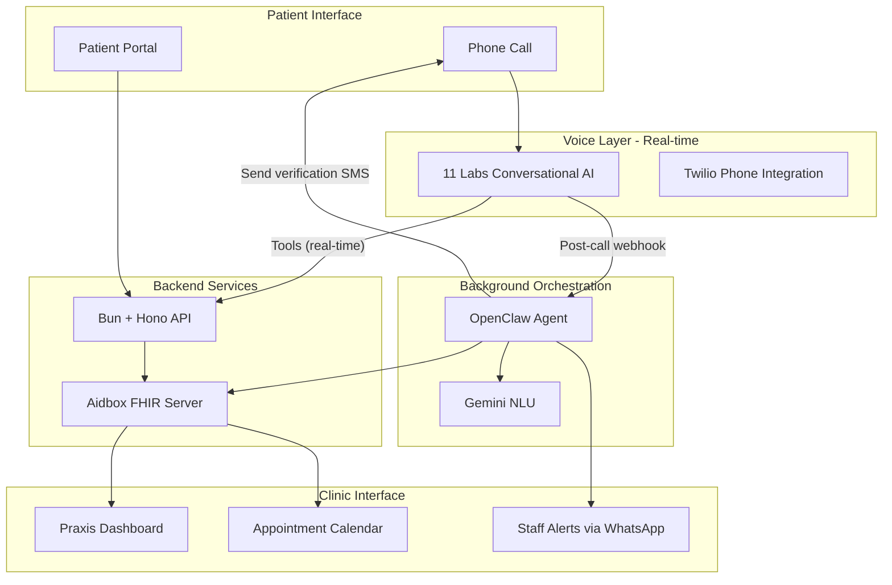

# Ignis - AI-Powered Patient Intake System

> "Give Doctors Their Time Back"

Ignis is an AI-powered patient intake system for German medical practices (Praxen) that automates phone-based patient registration and appointment booking using voice AI.

## The Problem

- ~100,000 Arztpraxen in Germany still rely on phone + paper intake
- Praxis staff spend 30-40% of their time on phone administration
- Patients wait an average of 12 minutes for phone scheduling
- Non-German speakers face significant barriers to healthcare access
- Doctors lose valuable patient time to administrative overhead

## Our Solution

An AI voice agent that:

- **Handles intake calls 24/7** with an empathetic, caring voice
- **3-tier intelligent triage**: Emergency (→human agent→112), Urgent (→same-day), Regular (→booking)
- **Recognizes returning patients** and pre-fills known data
- **Speaks German + 30+ languages** natively via 11 Labs
- **Never gives medical advice** - safety-first design
- **Integrates with existing systems** via FHIR standard

## Key Features

| Feature | Description |
|---------|-------------|
| Voice Intake | AI collects patient info via natural conversation |
| 3-Tier Triage | Emergency/Urgent/Regular classification |
| Patient Lookup | Returning patients identified by phone/DOB |
| Verification Portal | Patients verify AI-collected data via secure link |
| AI Flags | Doctor sees flags for items needing verification |
| Praxis Dashboard | Real-time view of patients, appointments, urgent queue |

## Architecture

**Hybrid approach:** ElevenLabs handles real-time voice conversation, OpenClaw manages background tasks and smart notifications.



### Component Roles

| Component | Role | When |
|-----------|------|------|
| **ElevenLabs** | Voice conversation, triage, patient lookup, booking | During call (real-time) |
| **Bun + Hono API** | HTTP endpoints for ElevenLabs tools, web UIs | During call + web access |
| **Aidbox** | FHIR data storage (patients, appointments) | Always |
| **OpenClaw** | SMS notifications, staff alerts, call analysis, follow-ups | After call (background) |
| **Gemini** | Intent classification, confidence scoring | Called by OpenClaw |

## Tech Stack

| Layer | Technology | Purpose |
|-------|------------|---------|
| Frontend | Vite + React + TypeScript + Tailwind + shadcn/ui | Praxis dashboard + Patient portal |
| Backend | Bun + Hono | Real-time APIs for ElevenLabs tools |
| FHIR Server | Aidbox Cloud Sandbox | Patient/appointment data storage |
| Voice AI | 11 Labs Conversational AI | Phone conversation handling |
| Phone | Twilio (via 11 Labs) | Inbound/outbound calls |
| Background Agent | OpenClaw | Post-call tasks, notifications, follow-ups |
| NLU | Gemini | Intent classification, confidence scoring |

## Project Status

✅ **Completed** (Foundation + Backend API — ~50%)
- ✅ Backend scaffold (Bun + Hono) with health check endpoint
- ✅ Frontend scaffold (Vite + React + TypeScript)
- ✅ Tailwind CSS v4 integration
- ✅ shadcn/ui components (button, card, input, form, calendar, label)
- ✅ Path aliases configured (@/* → src/*)
- ✅ Docker-based deployment (app, Aidbox, nginx)
- ✅ Automated deployment scripts (setup-remote.sh, update-server.sh)
- ✅ Nginx reverse proxy routing (/app, /api, /fhir)
- ✅ FHIR client and Aidbox integration (config, fhir-client, aidbox-patients, aidbox-appointments)
- ✅ Real API for patients (lookup by phone/DOB/name, create/update) backed by Aidbox
- ✅ Patient lookup with returning patient pre-fill (patientId, patientName, upcomingAppointment)
- ✅ Appointments API: slots (with urgency filter), book, cancel — cancel backed by Aidbox
- ✅ Queue API stubs: POST /api/queue/urgent, POST /api/queue/emergency
- ✅ Callback API stub: POST /api/callback
- ✅ OpenAPI spec (GET /api/openapi.json) and CORS for ElevenLabs voice tools

🚧 **In Progress** (Next Steps)
- 🔄 UI pages (Praxis dashboard, Patient portal) — page scaffolds exist; wiring to API in progress
- 🔄 ElevenLabs voice integration (German conversation flow using backend APIs)

🔴 **Not Started** (Remaining Core Features — ~45%)
- ❌ 3-tier triage logic in voice flow (API stubs exist; agent flow not wired)
- ❌ Emergency detection (always-on interrupt during call)
- ❌ Patient verification portal (token-based secure access)
- ❌ AI flagging system (uncertain fields for doctor review)
- ❌ OpenClaw background tasks (SMS, WhatsApp, call analysis)
- ❌ German seed data (Ärzte, schedules, sample patients — demo bundle exists)
- ❌ Pitch deck and demo preparation

📋 **Full Plan**: See [docs/PLAN.md](docs/PLAN.md)

## Quick Start

### 1. Install Dependencies

**Backend** (Bun + Hono)
```bash
# Bun is already installed in the project
~/.bun/bin/bun install
```

**Frontend** (Vite + React)
```bash
cd frontend
~/.bun/bin/bun install
```

### 2. Start Development Servers

**Terminal 1 - Backend** (port 3000)
```bash
~/.bun/bin/bun run dev
```

**Terminal 2 - Frontend** (port 5173)
```bash
cd frontend
~/.bun/bin/bun run dev
```

Open http://localhost:5173 in your browser.

### Backend for ElevenLabs (Voice Team)

The Bun backend exposes the API contract and endpoints used by the ElevenLabs Conversational AI agent during real-time patient intake calls.

| Item | Value |
|------|--------|
| **Base URL (local)** | `http://localhost:3000` |
| **Base URL (deployed)** | `https://ignis.cognovis.de` (or set `API_BASE_URL` in env) |
| **OpenAPI spec** | `GET /api/openapi.json` — load this URL in ElevenLabs tools so the agent uses the correct request/response shapes. The spec’s `servers[0].url` is set from `API_BASE_URL` (default `http://localhost:3000/api`). |
| **CORS** | Enabled for `/api/*`; cross-origin requests from the voice app are allowed. |

**Endpoints (per OpenAPI):**

- **Patients:** `GET /api/patients/lookup` (phone, birthDate), `POST /api/patients` (create/update) — backed by Aidbox FHIR.
- **Appointments:** `GET /api/appointments/slots` (date, practitionerId?, limit?), `POST /api/appointments` (slotId, patientId) — **stub** implementations return fixed/mock slots and confirm booking without persisting to FHIR (for voice testing). Real FHIR Slot/Appointment wiring can follow.
- **Queue:** `POST /api/queue/urgent` (patientId), `POST /api/queue/emergency` (optional body) — **stub** implementations return 201 with generated IDs; no persistence yet.

Use the same base URL for all requests (e.g. `http://localhost:3000/api/patients/lookup?birthDate=1985-03-15`).

### 3. Setup Aidbox (Optional - for FHIR backend)

**Get Aidbox License** (Free for Development)

1. Go to [https://aidbox.app](https://aidbox.app) and create an account
2. After login, click on your **project name** in the sidebar
3. Click **Assets** → **New Aidbox**
4. Configure: License type = **Dev**, Hosting = **Self-hosted**
5. Copy the `AIDBOX_LICENSE_ID` and `AIDBOX_LICENSE_KEY`

**Configure and Start**

```bash
cp .env.example .env
# Edit .env and add your Aidbox keys

./infra/setup-aidbox.sh
```

This will:
- Start PostgreSQL and Aidbox containers
- Wait for health checks
- Load demo FHIR data (patients, practitioners, appointments)

**Verify**

- Aidbox UI: http://localhost:8080 (admin/ignis2026)

## Deployment

### Initial Setup (New Server)

```bash
# 1. Provision Hetzner server
./infra/provision.sh

# 2. Setup everything (clones repo, builds and starts all services)
./infra/setup-remote.sh <server-ip>
```

This will:
- Clone the repo to `/opt/ignis`
- Build Docker image for the app (Bun backend + React frontend)
- Start all Docker services (app, Aidbox, nginx)
- Configure nginx reverse proxy

### Updating Existing Server

After pushing code changes:

```bash
./infra/update-server.sh [server-ip]
```

This will:
- Pull latest code
- Rebuild Docker images
- Restart all services

### Manual Deployment

On the server:

```bash
cd /opt/ignis
git pull origin main
docker compose up -d --build
```

### Service Management

```bash
# Check all services
docker compose ps

# View logs
docker compose logs -f

# View specific service logs
docker compose logs app -f
docker compose logs aidbox -f
docker compose logs nginx -f

# Restart a service
docker compose restart app

# Rebuild and restart
docker compose up -d --build app
```

## Infrastructure

See `infra/` directory for server provisioning:

```bash
# Provision Hetzner server
./infra/provision.sh

# Setup after provisioning
./infra/setup-remote.sh <server-ip>

# Update after code changes
./infra/update-server.sh <server-ip>

# Add team member SSH keys
./infra/user-setup.sh <server-ip>

# Teardown when done
./infra/teardown.sh
```

## Server Access

```bash
ssh hackathon@167.235.236.238
```

## Services

| Service | Access | Credentials |
|---------|--------|-------------|
| **Ignis App** | http://server-ip/app/ | - |
| **Ignis API** | http://server-ip/api/ | - |
| **Aidbox UI** | http://server-ip/ | admin / ignis2026 |
| **FHIR API** | http://server-ip/fhir/ | admin / ignis2026 |

All services run in Docker and are proxied through nginx.

### Service Architecture

The **Ignis App** runs as a single Docker container that includes both:
- **Backend**: Bun + Hono server (port 3000)
  - Handles `/api/*` routes
  - Serves built frontend static files
- **Frontend**: React app (built as static files)
  - Built during Docker image creation
  - Served by the Bun backend

```
Docker Container "app"
├── Bun Backend (Hono) - port 3000
│   ├── Handles /api routes
│   └── Serves built frontend static files
└── Frontend (React) - built as static files in /frontend/dist/
```

### Managing Services

```bash
# Check all services
docker compose ps

# Check specific service
docker compose ps app

# View logs
docker compose logs -f         # All services
docker compose logs app -f     # Just the app

# Restart a service
docker compose restart app
docker compose restart nginx

# Rebuild and restart
docker compose up -d --build app
```

## Project Structure

```
ignis/
├── src/                     # Bun + Hono backend
│   ├── index.ts             # Entry point (serves API + frontend)
│   ├── routes/              # API route handlers
│   │   ├── patients.ts      # Patient lookup, create/update
│   │   ├── appointments.ts # Slots, book, cancel
│   │   ├── queue.ts         # Urgent / emergency queue stubs
│   │   └── callback.ts      # Request callback stub
│   └── lib/                 # Shared libraries
│       ├── schemas.ts       # Zod validation schemas
│       ├── config.ts        # Env/config (Aidbox URL, auth)
│       ├── fhir-client.ts   # Low-level FHIR HTTP client
│       ├── aidbox-patients.ts   # Patient CRUD via Aidbox
│       ├── aidbox-appointments.ts # Appointments/cancel via Aidbox
│       └── dummy-data.ts    # Legacy mock data (reference)
├── frontend/                # Vite + React frontend
│   ├── src/
│   │   ├── App.tsx          # Main app component
│   │   ├── components/      # React components (ui/, praxis/)
│   │   ├── pages/           # Page scaffolds
│   │   │   ├── praxis/      # Dashboard
│   │   │   └── patient/     # Book, Intake, Verify
│   │   └── lib/             # Frontend utilities (api, utils)
│   └── dist/                # Built frontend (served by backend)
├── infra/                   # Infrastructure & deployment
│   ├── setup-remote.sh      # Initial server setup
│   ├── update-server.sh     # Quick update script
│   ├── setup-aidbox.sh      # Aidbox setup script
│   ├── setup-services.sh    # Service configuration
│   ├── provision.sh         # Hetzner provisioning
│   ├── nginx/               # Nginx configs
│   └── ssl/                 # SSL certificates
├── docs/                    # Documentation
│   └── PLAN.md              # Detailed implementation plan
├── aidbox/                  # FHIR seed data
│   └── seed/
├── Dockerfile               # Docker image for app (backend + frontend)
└── docker-compose.yaml      # Multi-container orchestration
```

## Documentation

See [docs/PLAN.md](docs/PLAN.md) for the detailed implementation plan including:
- Flow diagrams (Architecture, Triage, Emergency Detection, Verification Portal)
- Team distribution and workstreams
- Pitch deck structure
- Demo script
- Technical specifications

## Team

Built at a hackathon by Team Ignis, leveraging:
- 11 Labs (Voice AI)
- Gemini (NLU)
- Aidbox (FHIR)
- OpenClaw (Agent)
- Cursor (IDE)

## License

MIT
