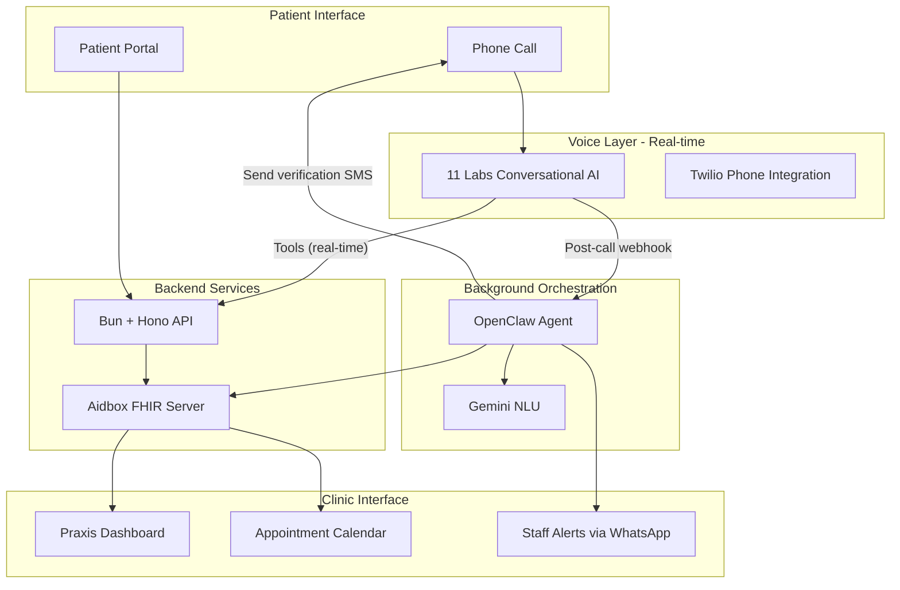
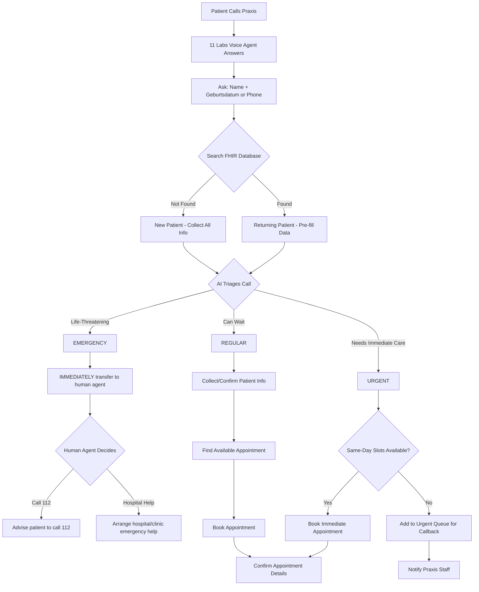
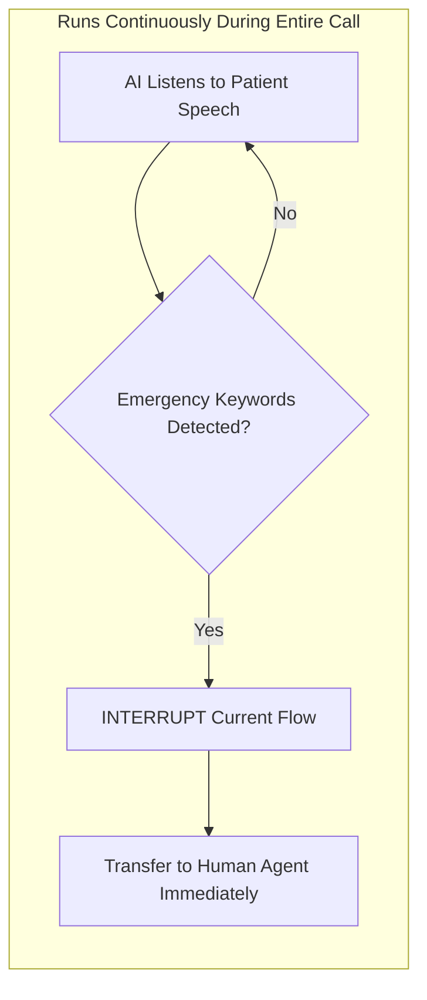
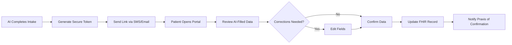
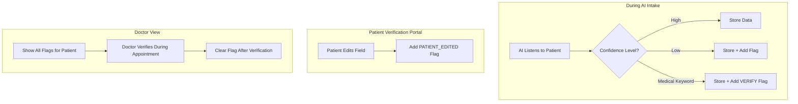

# Patient Intake AI System - Hackathon Plan

> **Project:** Ignis  
> **Overview:** Build an AI-powered patient intake system for German medical practices (Praxen) with voice interaction via 11 Labs, FHIR backend on Aidbox, and OpenClaw agent orchestration. Features 3-tier triage (Emergency/Urgent/Regular), returning patient lookup, and EU-expandable architecture.

## Todos

- [x] Initialize Bun project with Hono API and Next.js frontend with Tailwind and shadcn/ui
- [x] Create Aidbox sandbox instance and configure FHIR resources (Patient, Appointment, Practitioner, Schedule)
- [ ] Set up 11 Labs Conversational AI agent with patient intake conversation flow (German language primary) **[ig-pfb](bd://ig-pfb)**
- [x] Build Aidbox API client with Patient and Appointment CRUD operations
- [x] Implement patient lookup by phone/DOB with pre-fill for returning patients
- [ ] Build 3-tier triage logic (Emergency->human transfer, Urgent->same-day queue, Regular->standard booking) **[ig-pfb](bd://ig-pfb)**
- [ ] Implement always-on emergency detection that can interrupt conversation at any point and transfer to human **[ig-f1z](bd://ig-f1z)**
- [ ] Build patient verification portal with secure token-based access for reviewing/editing AI-filled data **[ig-i1u](bd://ig-i1u)**
- [ ] Implement AI flagging system for uncertain/important fields that doctor should verify during appointment **[ig-96p](bd://ig-96p)**
- [x] Create clinic dashboard with real-time patient queue, urgent queue, and appointment calendar
- [x] Build patient intake form and appointment booking interface
- [ ] Connect 11 Labs voice agent to backend APIs via webhooks **[ig-pfb](bd://ig-pfb)**
- [ ] Create realistic German demo seed data (Ärzte, schedules, sample patients) **[ig-6m1](bd://ig-6m1)**
- [ ] Complete pitch deck with German/EU market focus, problem, solution, demo, and monetization **[ig-6m1](bd://ig-6m1)**
- [ ] End-to-end demo rehearsal and backup video recording **[ig-6m1](bd://ig-6m1)**

**Progress: ~65% Complete** | **Backend: 95%** | **Frontend: 70%** | **Voice: 40%** | **Demo: 5%**

---

## Architecture Overview

**Hybrid Approach:** ElevenLabs handles real-time voice conversation during the call via Twilio. OpenClaw manages background tasks after the call ends (SMS, notifications, analysis). Next.js frontend runs as separate service from Bun API backend.

**Current Implementation:** Next.js 15 (App Router) frontend + Bun + Hono backend + Aidbox FHIR + PostgreSQL, all in Docker containers with nginx reverse proxy.

## Current Project Status (Updated: 2026-02-01)

**Overall: ~65% Complete**

### ✅ Completed Components

**Backend API (95% Complete):**
- ✅ Full REST API with 50+ endpoints
- ✅ Patients: lookup (phone/DOB/name), create, update
- ✅ Appointments: slots (urgency filter), book, cancel
- ✅ Queue: urgent, emergency (Aidbox Task-backed)
- ✅ Callback: request callback
- ✅ Questionnaires: list, search, patient-intake endpoint
- ✅ Auth: JWT with 3-tier patient authentication (identify, authenticate, authorize)
- ✅ Chat: AI-powered chat sessions
- ✅ Voice: Twilio integration with WebSocket media streaming
- ✅ Doctor: patient management, medication requests
- ✅ OpenAPI spec + CORS for ElevenLabs
- ✅ Comprehensive test suite (10 test files)

**Infrastructure (95% Complete):**
- ✅ Docker multi-container setup (frontend, api, aidbox, db, nginx)
- ✅ Automated deployment scripts
- ✅ Health checks and service orchestration
- ✅ Nginx reverse proxy with SSL support

**Frontend (70% Complete):**
- ✅ Next.js 15 App Router + TypeScript
- ✅ Tailwind CSS v4 + shadcn/ui
- ✅ Dashboard pages (Fragebogen, Termine, Wartezimmer, Patient details)
- ✅ Chat interface
- ✅ Calendar views
- ✅ Questionnaire forms
- 🔄 Some frontend-backend wiring incomplete

### 🔴 Missing Critical Features

**High Priority (P1):**
- ❌ Patient Verification Portal ([ig-i1u](bd://ig-i1u))
- ❌ AI Flags System ([ig-96p](bd://ig-96p))
- ❌ Emergency Detection ([ig-f1z](bd://ig-f1z)) - Safety-critical
- ❌ ElevenLabs Voice Flow ([ig-pfb](bd://ig-pfb))
- ❌ Demo Materials ([ig-6m1](bd://ig-6m1))

**Medium Priority (P2):**
- ❌ OpenClaw Background Tasks ([ig-mnm](bd://ig-mnm))

---



### Component Responsibilities

| Component | Responsibility | Timing |
|-----------|----------------|--------|
| **ElevenLabs** | Voice conversation, triage logic, patient lookup, appointment booking | Real-time (during call) |
| **Bun + Hono API** | HTTP endpoints for ElevenLabs tools, serve React frontend | Real-time |
| **Aidbox FHIR** | Store patients, appointments, practitioner schedules | Persistent storage |
| **OpenClaw** | Send verification SMS, alert staff via WhatsApp, analyze calls, schedule follow-ups | Background (after call) |
| **Gemini** | Intent classification, confidence scoring for AI flags | Called by OpenClaw |

### Data Flow

1. **During Call (Real-time path):**
   - Patient calls → ElevenLabs answers
   - ElevenLabs uses Tools to call Bun + Hono APIs (patient lookup, book appointment)
   - Bun + Hono APIs read/write to Aidbox

2. **After Call (Background path):**
   - ElevenLabs sends post-call webhook to OpenClaw
   - OpenClaw processes call transcript with Gemini (confidence scoring)
   - OpenClaw sends verification SMS to patient
   - OpenClaw alerts staff via WhatsApp if urgent
   - OpenClaw updates Aidbox with AI flags

### Route overview

Backend routes are mounted under `/api`. These are the HTTP endpoints used by **ElevenLabs Tools** during the call; some are also used by the **React frontend** (patient portal, praxis dashboard). Full request/response contracts: **[backend-services-elevenlabs.openapi.yaml](backend-services-elevenlabs.openapi.yaml)** (OpenAPI 3.0.3).

| Method | Path | Operation ID | Purpose |
|--------|------|--------------|---------|
| GET | `/api/patients/lookup` | `patient_lookup` | Find returning patient by phone and/or birthDate (Geburtsdatum). |
| POST | `/api/patients` | `patient_create_or_update` | Create or update Patient with intake data (family, given, birthDate, phone, etc.). |
| GET | `/api/appointments/slots` | `get_available_slots` | List bookable slots for a date (query: date, optional practitionerId, limit). |
| POST | `/api/appointments` | `book_appointment` | Create Appointment for a chosen slotId and patientId. |
| POST | `/api/queue/urgent` | `add_to_urgent_queue` | Add patient to urgent callback queue (when triage=Urgent, no same-day slot). |
| POST | `/api/queue/emergency` | `register_emergency_transfer` | Log emergency transfer to human (for dashboard/alerting). |

**For agents:** Use the **operation ID** column when wiring ElevenLabs Tools to these routes. Request/response schemas, error codes, and parameter details are in the OpenAPI spec.

**Planned (not in OpenAPI yet):** Verification and portal routes (e.g. `GET /api/verify/[token]`, `POST /api/verify/submit`) for the patient verification flow; dashboard may add GETs for queue and calendar.

## Patient Call Flow (3-Tier Triage)



## Emergency Detection - Always Active



**Key Principle:** Emergency detection runs as a background process throughout the entire conversation. Even if the patient initially calls for a routine appointment but suddenly says "I'm having chest pain" mid-conversation, the AI must immediately detect this and transfer to a human agent.

**Emergency Keywords (German + English):**

- Herzinfarkt, heart attack, Brustschmerzen, chest pain
- Kann nicht atmen, can't breathe, Atemnot, shortness of breath
- Starke Blutung, severe bleeding, Ohnmacht, fainting
- Schlaganfall, stroke, Krampfanfall, seizure
- Suizid, suicide, selbst verletzen, self-harm
- Bewusstlos, unconscious, nicht ansprechbar, unresponsive

## Patient Verification Portal

After AI completes the intake call, a secure link is sent to the patient (via SMS or email) to verify the data AI collected.



**Portal Features:**
- Read-only view of AI-collected data with edit capability
- Highlight fields AI was uncertain about (low confidence)
- Simple mobile-friendly interface
- Secure token-based access (no login required)
- Time-limited link (expires after 24-48 hours)

## AI Flags for Doctor Review

AI marks certain items that the doctor should verify during the actual appointment.



**How Flags Appear:**
- In **Praxis Dashboard**: Flag icons next to patient entries
- In **Patient Details View**: Highlighted fields with flag explanation
- In **Doctor View**: Summary of all flags for quick pre-appointment review

**Flag Types:**

| Flag Type | Color | Meaning | Example |
|-----------|-------|---------|---------|
| `VERIFY_IDENTITY` | Yellow | Confirm patient identity | Name spelling unclear in audio |
| `VERIFY_SYMPTOMS` | Orange | Clarify symptoms with patient | Patient described vague symptoms |
| `VERIFY_MEDICATION` | Orange | Confirm current medications | Patient unsure of medication names |
| `VERIFY_ALLERGY` | Red | Confirm allergies | Patient mentioned possible allergy |
| `LOW_CONFIDENCE` | Gray | AI unsure about transcription | Background noise, unclear speech |
| `PATIENT_EDITED` | Blue | Patient modified this field in portal | Data changed after AI intake |

## AI Guardrails (Critical)

The voice agent MUST follow these guardrails:

1. **Never give medical advice** - AI only collects information, never diagnoses or recommends treatment
2. **Emergency detection is ALWAYS ON** - Runs continuously during entire conversation, not just at triage stage
3. **Emergency = Transfer to human** - AI does NOT tell patient to call 112 directly; instead transfers to human agent who makes that decision
4. **Interrupt capability** - If patient mentions emergency symptoms at ANY point (even mid-sentence), AI must interrupt normal flow and transfer immediately
5. **Empathetic tone** - Caring, patient voice; never rushed or robotic
6. **Escalation path** - When uncertain about severity, always escalate to human staff
7. **Data confirmation** - Always repeat back critical info (DOB, phone, symptoms) for verification

## MVP Scope (12-24 hours)

Given time constraints, focus on these **demo-ready** features:

### Core Features (Must Have)

1. **Voice-based patient intake** - Patient calls, AI collects info (Name, Geburtsdatum, symptoms)
2. **3-tier triage system**:
   - Emergency → Transfer to human agent
   - Urgent → Same-day queue / immediate booking
   - Regular → Standard appointment booking
3. **Returning patient lookup** - Search by phone/DOB, pre-fill known data
4. **Appointment booking** - AI checks availability and schedules appointments
5. **Praxis dashboard** - Real-time view of incoming patients, urgent queue, and calendar
6. **Patient verification portal** - After AI intake, send secure link for patient to verify/correct AI-filled data
7. **AI flags for doctor review** - AI marks uncertain or important items that doctor should verify during appointment

### Nice-to-Have (If Time Permits)

- Multilingual support (German + English for demo)
- SMS confirmation via Twilio

### Roadmap Items (Mention in Pitch)

- Überweisung (referral) document generation
- Gesundheitskarte / Versichertennummer verification
- Integration with existing PVS (Praxisverwaltungssystem)
- GDPR compliance audit
- Multi-practice support for larger Praxisgruppen

---

## Team Distribution (5 Members)

### Person 1: Voice/AI Integration Lead

**Focus:** 11 Labs (real-time voice) + OpenClaw (background tasks)

**Real-time (ElevenLabs):**
- Set up 11 Labs Conversational AI agent (German language primary)
- Configure empathetic voice prompts and conversation flows
- Implement 3-tier triage logic in ElevenLabs system prompt
- **Implement always-on emergency detection** - runs continuously, can interrupt at any point
- **Implement human agent transfer** - emergency cases transfer to human, not direct 112 redirect
- Configure ElevenLabs Tools to call Bun + Hono APIs (patient lookup, appointment booking)
- Integrate with Twilio for phone number

**Background (OpenClaw):**
- Set up OpenClaw on Hetzner server
- Configure post-call webhook from ElevenLabs to OpenClaw
- Implement verification SMS sending via OpenClaw
- Set up staff alerts via WhatsApp/Telegram
- Use Gemini for confidence scoring and AI flag generation

**Key files to create:**

- `src/lib/elevenlabs/agent-config.ts` - Voice agent configuration with German prompts
- `src/lib/elevenlabs/tools-config.ts` - ElevenLabs Tools pointing to Bun + Hono APIs
- `src/lib/elevenlabs/system-prompt.md` - Triage logic and emergency detection rules
- `src/lib/openclaw/post-call-handler.ts` - Handle post-call webhook
- `src/lib/openclaw/verification-sender.ts` - Send verification SMS
- `src/lib/openclaw/staff-alerter.ts` - WhatsApp/Telegram alerts
- `src/lib/ai/confidence-scorer.ts` - Gemini-based AI flag generation

### Person 2: FHIR Backend Lead

**Focus:** Aidbox + Data Models + Verification API

- Set up Aidbox sandbox instance
- Create FHIR resources: Patient, Appointment, Practitioner, Schedule
- Build API wrapper for FHIR operations
- **Implement patient lookup by phone/DOB** (returning patient detection)
- Implement appointment slot availability logic
- Create urgent queue data structure
- **Build verification token API** - Generate secure tokens, validate, accept updates
- **Implement AI flags storage** - Store flags with patient record in FHIR

**Key files to create:**

- `src/lib/fhir/aidbox-client.ts` - Aidbox API client
- `src/lib/fhir/resources/` - FHIR resource types
- `src/lib/fhir/flags.ts` - Flag types and utilities
- `src/lib/verify/token-generator.ts` - Secure token generation
- `src/lib/verify/send-link.ts` - SMS/email link sending
- `src/api/patients.ts` - Patient CRUD + lookup by phone/DOB
- `src/api/appointments.ts` - Appointment booking
- `src/api/queue.ts` - Urgent queue management
- `src/api/verify.ts` - Token validation + submit verified data

### Person 3: Praxis Dashboard UI

**Focus:** Vite + React + Tailwind (Praxis-facing)

- Build real-time dashboard showing incoming patients
- Appointment calendar view (Terminkalender)
- **Urgent queue with priority highlighting**
- **Emergency transfer alert** - prominent alert when AI transfers emergency call to human agent
- Patient details panel with pre-filled info and **AI flags display**
- Visual indicator for new vs returning patients
- **Doctor view** - Summary of AI flags for pre-appointment review

**Key pages to create:**

- `frontend/src/pages/praxis/Dashboard.tsx` - Main dashboard with emergency alert banner
- `frontend/src/pages/praxis/Termine.tsx` - Calendar view (Terminkalender)
- `frontend/src/pages/praxis/Dringend.tsx` - Urgent queue
- `frontend/src/pages/praxis/Notfall.tsx` - Emergency transfers waiting for human agent
- `frontend/src/pages/praxis/PatientDetail.tsx` - Patient details with **AI flags highlighted**
- `frontend/src/components/praxis/EmergencyAlert.tsx` - Flashing/audio alert for emergency transfers
- `frontend/src/components/praxis/PatientFlags.tsx` - Display all AI flags for a patient
- `frontend/src/components/praxis/FlagBadge.tsx` - Individual flag badge (VERIFY_IDENTITY, etc.)

### Person 4: Patient Interface UI

**Focus:** Vite + React + Tailwind (Patient-facing)

- Patient intake form (web fallback)
- **Patient verification portal** - Secure page to review/edit AI-filled data
- Appointment confirmation page
- Voice call initiation button
- Mobile-responsive design
- Highlight AI-flagged uncertain fields

**Key pages to create:**

- `frontend/src/pages/patient/Intake.tsx` - Intake form
- `frontend/src/pages/patient/Book.tsx` - Booking interface
- `frontend/src/pages/patient/Confirmation.tsx` - Confirmation
- `frontend/src/pages/patient/Verify.tsx` - **Verification portal with editable form** (token in URL param)
- `frontend/src/components/patient/VerificationForm.tsx` - Editable form showing AI data
- `frontend/src/components/patient/FlaggedField.tsx` - Highlighted fields AI was uncertain about

### Person 5: Demo/Pitch/Integration Lead

**Focus:** Pitch deck + Demo flow + Glue code

- Create pitch deck (use Miro/Slides)
- Write demo script
- Handle integration between components
- Create seed data for realistic demo
- Record backup video using Runway (if live demo fails)

**Key deliverables:**

- `docs/pitch-deck.md` - Pitch content
- `scripts/seed-data.ts` - Demo data
- `docs/demo-script.md` - Demo walkthrough

---

## Technical Stack

| Layer | Technology | Purpose | When Used |
|-------|------------|---------|-----------|
| Frontend | Vite + React + Tailwind + shadcn/ui | Praxis dashboard + Patient portal | Web access |
| Backend | Bun + Hono | API endpoints for ElevenLabs tools, webhooks | During call (real-time) |
| FHIR Server | Aidbox Cloud Sandbox | Patient/appointment data storage | Always |
| Voice AI | 11 Labs Conversational AI | Phone conversation, triage, booking | During call (real-time) |
| Phone | Twilio (via 11 Labs) | Inbound/outbound calls | During call |
| Background Agent | OpenClaw | Post-call tasks, SMS, staff alerts | After call (background) |
| NLU/Classification | Gemini | Intent classification, confidence scoring | Called by OpenClaw |

---

## Project Structure

```
ignis/
├── src/                          # Bun + Hono backend
│   ├── index.ts                  # Hono app entry point
│   ├── api/                      # Hono API routes
│   │   ├── patients.ts           # Patient CRUD + lookup
│   │   ├── appointments.ts       # Appointment booking
│   │   ├── queue.ts              # Urgent queue management
│   │   ├── verify.ts             # Token validation + submit
│   │   └── voice-webhook.ts      # ElevenLabs webhook handler
│   └── lib/                      # Shared backend utilities
│       ├── elevenlabs/
│       │   ├── agent-config.ts
│       │   ├── conversation-flow.ts
│       │   └── emergency-detector.ts
│       ├── fhir/
│       │   ├── aidbox-client.ts
│       │   ├── resources/
│       │   └── flags.ts          # Flag types and utilities
│       ├── openclaw/
│       │   └── patient-intake-agent.ts
│       ├── ai/
│       │   ├── triage-classifier.ts
│       │   └── confidence-scorer.ts
│       └── verify/
│           ├── token-generator.ts
│           └── send-link.ts
├── frontend/                     # Vite + React frontend
│   ├── src/
│   │   ├── main.tsx              # React entry point
│   │   ├── App.tsx               # Router setup
│   │   ├── pages/
│   │   │   ├── praxis/           # Praxis (clinic) dashboard
│   │   │   │   ├── Dashboard.tsx
│   │   │   │   ├── Termine.tsx   # Appointments calendar
│   │   │   │   ├── Dringend.tsx  # Urgent queue
│   │   │   │   ├── Notfall.tsx   # Emergency transfers
│   │   │   │   └── PatientDetail.tsx  # Patient details with flags
│   │   │   ├── patient/          # Patient-facing UI
│   │   │   │   ├── Intake.tsx
│   │   │   │   ├── Book.tsx
│   │   │   │   ├── Confirmation.tsx
│   │   │   │   └── Verify.tsx    # Verification portal
│   │   │   └── Landing.tsx
│   │   └── components/
│   │       ├── praxis/
│   │       │   ├── EmergencyAlert.tsx
│   │       │   ├── PatientFlags.tsx
│   │       │   └── FlagBadge.tsx
│   │       ├── patient/
│   │       │   ├── VerificationForm.tsx
│   │       │   └── FlaggedField.tsx
│   │       └── ui/               # shadcn components
│   ├── index.html
│   └── vite.config.ts
├── dist/                         # Built frontend (served by Hono)
├── docs/
│   ├── pitch-deck.md
│   └── demo-script.md
├── scripts/
│   └── seed-data.ts              # German demo data
├── package.json
├── tsconfig.json
└── Dockerfile
```

---

## Pitch Deck Structure (5-7 slides)

### Slide 1: Problem

- ~100,000 Arztpraxen in Germany, most still use phone + paper intake
- Average 12-minute wait for phone scheduling; patients often give up
- Praxis staff spend 30-40% of time on phone administration
- Non-German speakers face significant barriers to healthcare access
- Doctors lose valuable patient time to administrative overhead

### Slide 2: Solution - "Give Doctors Their Time Back"

- AI voice agent handles intake calls 24/7 with empathetic, caring voice
- 3-tier intelligent triage: Emergency (→human agent), Urgent (→same-day), Regular (→booking)
- Returning patient recognition - pre-fills known data
- Speaks German + 30+ languages natively
- **Never gives medical advice** - safety-first design
- Integrates with existing systems via FHIR standard

### Slide 3: Demo

- Live call to the system (German)
- Show returning patient lookup + pre-fill
- Show urgent case going to priority queue
- Show emergency mid-call interrupt → transfer to human
- Display Praxis dashboard updating in real-time
- Show patient verification portal + AI flags for doctor

### Slide 4: Technology

- Architecture diagram (from above)
- Built on open standards (FHIR R4) - compatible with any PVS
- Powered by: 11 Labs, Gemini, OpenClaw, Aidbox
- EU data residency possible (GDPR-ready architecture)

### Slide 5: Market and Monetization

**Target Market (Germany first, then EU):**

- ~100,000 Arztpraxen in Germany
- ~500,000 practices across EU
- EUR 2.1B German healthcare IT market (growing 8% annually)

**Monetization:**

- SaaS: EUR 199-499/month per Praxis (based on call volume)
- Per-call pricing: EUR 0.40-1.00 per completed intake
- Enterprise: Custom pricing for Praxisgruppen and MVZ

**Value Proposition:**

- Reduce staff phone time by 70%
- 24/7 availability - never miss a patient call
- Multilingual = serve diverse patient populations
- Intelligent triage reduces liability and improves outcomes

### Slide 6: Roadmap

- Hackathon MVP (today)
- Pilot with 3 Praxen in Germany (Month 1-2)
- Überweisung (referral) automation (Month 2)
- Gesundheitskarte integration (Month 3)
- GDPR compliance audit (Month 3)
- PVS integrations (CGM, mediatixx) (Month 4-6)
- EU expansion (Month 6+)

### Slide 7: Team and Ask

- Team intro
- Ask: "Looking for Praxis partners for pilot program"

---

## Demo Script (3-5 minutes)

### Demo 1: Returning Patient - Regular Appointment (60s)

1. Patient calls: "Hallo, ich möchte einen Termin für eine Impfung"
2. AI greets warmly, asks for name + Geburtsdatum
3. AI finds existing patient record, confirms: "Herr Schmidt, ich sehe Sie waren zuletzt am..."
4. AI books appointment, confirms details
5. **Show:** Praxis dashboard updates with new appointment

### Demo 2: New Patient - Urgent Case (90s)

1. Patient calls: "Ich hatte gestern eine Operation und jetzt blutet die Wunde"
2. AI recognizes post-procedure complication → classifies as URGENT
3. AI collects patient info (new patient flow)
4. AI checks same-day availability, books urgent slot
5. **Show:** Patient appears in Urgent Queue on Praxis dashboard with priority flag

### Demo 3: Emergency Detection - Immediate Human Transfer (45s)

**Scenario: Emergency interrupts mid-conversation**
1. Patient calls for routine appointment: "Ich möchte einen Termin für..."
2. Mid-conversation, patient suddenly says: "...warten Sie, ich habe gerade starke Brustschmerzen"
3. AI immediately interrupts: "Ich höre, dass Sie Brustschmerzen haben. Das ist wichtig. Ich verbinde Sie sofort mit einem Mitarbeiter."
4. **Show:** Call transfers to human agent queue, alert appears on Praxis dashboard
5. **Explain:** Human agent decides whether to advise 112 or arrange clinic emergency help

### Demo 4: Patient Verification Portal + AI Flags (45s)

1. After call ends, patient receives SMS with secure verification link
2. **Show:** Patient opens verification portal on mobile
3. AI-flagged uncertain fields are highlighted (e.g., medication name was unclear)
4. Patient corrects a field → PATIENT_EDITED flag added automatically
5. Patient confirms data
6. **Show:** Praxis dashboard shows:
   - Patient verification complete checkmark
   - AI flags for doctor: "VERIFY_MEDICATION", "PATIENT_EDITED: Allergien"
7. **Explain:** Doctor sees flags before appointment, knows what to double-check

### Closing (30s)

- Show architecture diagram
- Market opportunity (100K Praxen in Germany)
- Ask: Pilot partners wanted

---

## Environment Variables Needed

```env
# Aidbox
AIDBOX_URL=https://your-instance.aidbox.app
AIDBOX_CLIENT_ID=your-client-id
AIDBOX_CLIENT_SECRET=your-secret

# 11 Labs
ELEVENLABS_API_KEY=your-api-key
ELEVENLABS_AGENT_ID=your-agent-id

# Gemini
GOOGLE_AI_API_KEY=your-gemini-key

# Twilio (optional)
TWILIO_ACCOUNT_SID=your-sid
TWILIO_AUTH_TOKEN=your-token
TWILIO_PHONE_NUMBER=+1xxxxxxxxxx
```

---

## Quick Start Commands

```bash
# Initialize Bun project
bun init

# Add backend dependencies
bun add hono @hono/zod-validator zod
bun add @google/generative-ai axios date-fns

# Create frontend with Vite + React
bun create vite frontend --template react-ts
cd frontend && bun install

# Add Tailwind to frontend
bun add -D tailwindcss postcss autoprefixer
bunx tailwindcss init -p

# Add frontend dependencies
bun add react-router-dom react-hook-form @tanstack/react-query

# Initialize shadcn/ui in frontend
bunx shadcn@latest init
bunx shadcn@latest add button card input form calendar

# Return to root
cd ..
```

---

## Parallel Workstreams Timeline

| Hour | Person 1 (Voice/AI) | Person 2 (FHIR/Backend) | Person 3 (Praxis UI) | Person 4 (Patient UI) | Person 5 (Demo) |
|------|---------------------|-------------------------|----------------------|-----------------------|-----------------|
| 0-2 | 11 Labs setup (German) | Bun + Hono scaffold, Aidbox sandbox | Vite + React scaffold | Vite + React scaffold | Pitch deck draft |
| 2-4 | Voice prompts + triage | FHIR client + flags | Dashboard layout | Intake form | Demo script (German) |
| 4-6 | ElevenLabs Tools config | Patient lookup API | Urgent queue UI | Verification portal | Integration testing |
| 6-8 | Emergency detection | Verification token API | Emergency alert UI | Flagged field UI | Test ElevenLabs flow |
| 8-10 | OpenClaw setup | Appointment APIs | Patient flags display | Mobile responsive | Seed data (German) |
| 10-12 | OpenClaw SMS + alerts | Connect all APIs + static serving | Calendar + real-time | Confirmation page | End-to-end testing |
| 12+ | Bug fixes + polish | Bug fixes | Polish | Polish | Rehearse demo |

**Person 1 Priority:** Get ElevenLabs working first (hours 0-8), then add OpenClaw for background tasks (hours 8-12).

**Person 2 Note:** Set up Hono to serve the built frontend from `dist/` folder for single-deployment architecture.

---

## Risk Mitigation

1. **11 Labs issues:** Have backup TTS with browser speech synthesis
2. **Aidbox down:** Mock FHIR data locally
3. **Demo fails:** Pre-record video with Runway
4. **Time crunch:** Cut English demo, focus on core German flow only
5. **German NLU issues:** Pre-test common German medical phrases; have fallback keywords

## German Healthcare Context

For the demo and pitch, incorporate these German-specific elements:

| German Term | English | Usage in System |
|-------------|---------|-----------------|
| Praxis | Medical practice | UI labels, dashboard |
| Arzt/Ärztin | Doctor | Practitioner records |
| Termin | Appointment | Booking flow |
| Geburtsdatum | Date of birth | Patient lookup |
| Überweisung | Referral | Roadmap feature |
| Gesundheitskarte | Health insurance card | Roadmap feature |
| Notfall | Emergency | Triage keywords |
| Dringend | Urgent | Triage classification |

## Two Core System Functions

Remember the system performs two distinct functions:

1. **Patient Registration (Anmeldung)** - Routing incoming calls to the right process based on triage
2. **Patient Intake (Aufnahme)** - Collecting and storing patient information in FHIR format
